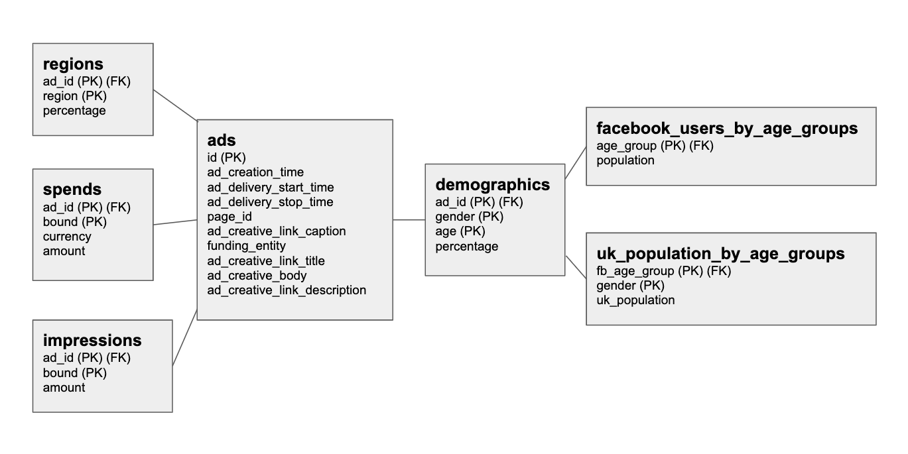

# Purpose

This project pull data on all the political ads run in the UK available from
Facebook's [Ad Library API](https://www.facebook.com/ads/library/api/). The
purpose of this to allow analysis of who is running what
ads, how much they're spending and what demographics they're targeting.

Once ads are pulled from the API they're uploaded into database tables and
then unnested and loaded into more accessible tables in a snowflake schema.

Data about the UK population and Facebook users by age group is also uploaded.

Data for over 100,000 ads is available and when the nested demographic data 
is extracted this gives well over 1m rows of data to work with.


# Tools used

The pipeline is run with Apache Airflow. Google Cloud Composer, which offers
 a managed environment (you don't have to worry about handling VM crashes), 
 was used to run Airflow. 
 
Data is uploaded into Google BigQuery. A data warehouse made for handling 
huge amounts of data.
  

# Set up

- You'll need a Facebook developer account, set up an app then get a user 
access token for it. Add this to the config.py file.
- The pipeline was made to be run in Google Cloud Composer, Google's managed
 version of Apache Airflow that runs on Kubernetes nodes. If you are not 
 also using Cloud Composer you'll likely need to:
     - Set up a service account on Google Cloud Platform
     - Give it permission to access BigQuery
     - Download the credentials json file
     - Set the `GOOGLE_APPLICATION_CREDENTIALS` environment variable to be the 
     path to it
     
Further details [here](https://cloud.google.com/docs/authentication/getting-started) 
if needed.


# Data Sources

- Facebook Ad Library: over 100k political ads containing nested information
 about them. Gives a data set of over 1 million rows when the demographic 
 information is split out.

- `guardian_facebook_users_2018.csv` is from 
this [Guardian article](https://www.theguardian.com/technology/2018/feb/12/is-facebook-for-old-people-over-55s-flock-in-as-the-young-leave) on 
Facebook users.
- `ons_uk_population_estimates_from_2016_for_2019.csv` is from the UK Office
 of National Statistics and available [here](https://www.ons.gov.uk/peoplepopulationandcommunity/populationandmigration/populationprojections/datasets/tablea11principalprojectionuksummary).


### Tables produced from sources




### Query example

As well looking at things like spend by party you can combine the ad spend 
data with population and user data to see who is being targeted the most.

For example the below query finds the average amount spent per facebook user
or per head of UK population in each age band:

```
WITH 
spend_by_age AS (
SELECT 
  ads.id,
  demos.age,
  
  --SUM(demos.percentage) to add male and female percentages
  spends.amount * SUM(demos.percentage) AS spend_on_age_group
FROM `bbm-data-lake-prod.markm_udacity_project2.ads` AS ads
LEFT JOIN `bbm-data-lake-prod.markm_udacity_project2.spends` AS spends
  ON ads.id = spends.ad_id
  AND spends.currency = 'GBP'
  AND spends.bound = 'midpoint'
LEFT JOIN `bbm-data-lake-prod.markm_udacity_project2.demographics` AS demos
  ON ads.id = demos.ad_id
GROUP BY ads.id, spends.amount, demos.age
),

agg_spend_by_age AS (
SELECT
  age,
  SUM(spend_on_age_group) AS spend
FROM spend_by_age
GROUP BY age
)

SELECT
  age,
  ROUND(SUM(spend), 2) AS gbp_spent,
  --sum uk population to add male and female rows
  ROUND(SUM(spend) / SUM(uk_pops.uk_population), 4) AS spend_per_head_uk_population,
  ROUND(SUM(spend) / fb_users.population, 4) AS spend_per_facebook_user
FROM agg_spend_by_age
LEFT JOIN `bbm-data-lake-prod.markm_udacity_project2.uk_population_by_age_groups` AS uk_pops
  ON agg_spend_by_age.age = uk_pops.fb_age_group
LEFT JOIN `bbm-data-lake-prod.markm_udacity_project2.facebook_users_by_age_groups` AS fb_users
  ON agg_spend_by_age.age = fb_users.age_group
GROUP BY age, fb_users.population
ORDER BY age

```

Which gives results of:


```
age     gbp_spent   spend_per_head_uk_population    spend_per_facebook_user
13-17    4626.86      0.001                           0.0025
18-24    66615.58     0.0119                          0.0148
25-34    121905.28    0.0135                          0.0169
35-44    93586.47     0.0111                          0.0159
45-54    82850.97     0.0091                          0.0148
55-64    68328.69     0.0084                          0.0195
65+      57593.23     0.0046                          0.0199
```


# Udacity Notes

This was done as a capstone project for the data engineering nanodegree 
course on Udacity and the below questions relate to that.

Approach to this project under the following scenarios:

The data was increased by 100x.

- Currently when ads are downloaded from the API they're saved to the local 
filesystem of the node running airflow before being uploaded to BigQuery. 
This would be changed to saving to Google Cloud Storage.

The pipelines would be run on a daily basis by 7 am every day.

- This would be done by changing the `schedule_interval` DAG variable in 
Airflow to a cron string of `0 7 * * *`

The database needed to be accessed by 100+ people.

- The database used, Google BigQuery, is able to handle huge scale so this 
amount of users wouldn't be an issue. Depending on the environment an groups
and roles with specific permissions may need to be created to make users 
don't make unintended changes.


